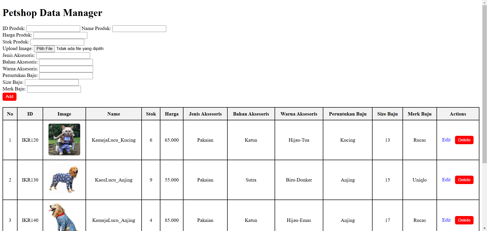

# TP2DPBO2025C2

## Janji 
Saya Abdurrahman Al Ghifari mengerjakan evaluasi Latihan Modul dalam mata kuliah 
Desain Pemrograman Berbasis Object untuk keberkahanNya maka saya tidak melakukan kecurangan 
seperti yang telah dispesifikasikan. Aamiin.

## Desain Program
Progam yang dibuat terdiri dari 2 bagian utama yang berisi 4 file, yaitu 1 Main file dan 3 class file yang pada kasus ini adalah Class Petshop, Class Aksesoris dan Class Baju

- Berikut adalah foto dari desain relasi Object pada program

- Penjelasan Desain
Program di desain untuk saling berhubungan dengan relasi "is a" atau inheritance, dimana Class Petshop sebagai pondasi dari class yang ada dibawah nya menjadi parent paling atas pada desain ini. Kemudian class Petshop memiliki child class Aksesoris sebagai turunan dalam mendetailkan maksud dari object Petshop itu sendiri. Class Aksesoris tidak hanya menjadi child class tapi sekaligus menjadi parent class juga yang memiliki child class Baju sebagai bentuk lebih terperinci nya object aksesoris yang dimaksud, sehingga keterhubungan inheritance yang terbentuk membuat desain ini termasuk ke Multi-Level inheritance. Pada method nya dari tiap kelasnya hanya memiliki method setter dan getter untuk masing-masing atribut nya, sedangkan child class paling bawah memiliki method fitur yang dapat dipergunakan user untuk memanipulasi data.

- Class Petshop terdiri dari 4 atribut utama dan 1 atribut khusus untuk bahasa PHP serta Method setter getter
Atribut Umum:
* ID Produk
* Nama Produk
* Harga Produk
* Stok Produk

Atribut Khusus:
* Gambar Produk (Bahasa PHP)

Method:
* Setter tiap atribut
* Getter tiap atribut

- Class Aksesoris terdiri dari 3 atribut utama serta Method setter getter
Atribut Umum:
* Jenis Aksesoris
* Bahan Aksesoris
* Warna Aksesoris

Method:
* Setter tiap atribut
* Getter tiap atribut

- Class Baju terdiri dari 3 atribut utama, Method setter getter dan method fitur manipulasi data
Atribut Umum:
* Peruntukan Baju
* Size Baju
* Merk Baju

Method:
* Setter tiap atribut
* Getter tiap atribut
* Menampilkan Data
* Update
* Delete
* Search

## Alur Program
- Program dimulai dengan ditampilkannya informasi awal yang bisa dilakukan user
- Terdapat 5 Fitur utama dan 1 command untuk mengakhiri program yang tergabung menjadi 6 Command Line
    - **view** -> untuk menampilkan data yang tersedia
    - **add** -> untuk menambahkan data
    - **update** -> untuk mengupdate/memperbaharui data yang sudah ada
    - **delete** -> untuk menghapus data
    - **search** -> untuk mencari data dengan kata kunci nama produk
    - **Exit** -> untuk keluar dari program

## Dokumentasi Program C++

## Dokumentasi Program Java

## Dokumentasi Program Python

## Dokumentasi Program PHP

[Demo Video](https://github.com/ghifarr1/TP2DPBO2025C2/blob/main/lang_php/Documentation/TP2_ProvPHP.mkv)